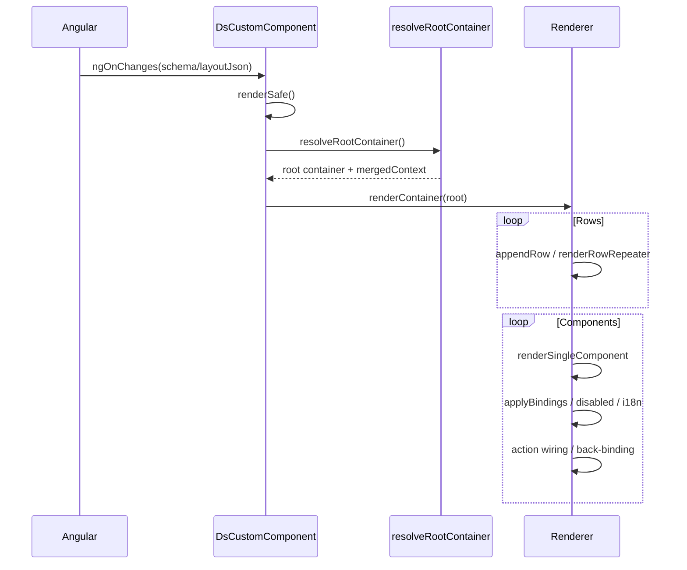
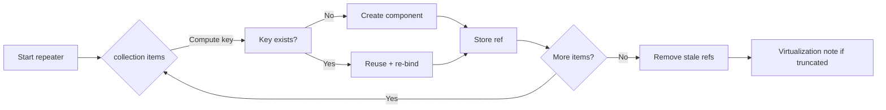

# ds-custom Component Execution Guide

This document explains how `DsCustomComponent` executes a layout schema: lifecycle, traversal hierarchy, repeaters, bindings, actions, and back-binding. Includes simple and complex examples plus debugging tips.

---
## 1. Runtime Stages (High-Level)
1. Input change (schema | layoutJson) -> `ngOnChanges` -> `renderSafe()`
2. `resolveRootContainer()`
   - Parse layoutJson if provided
   - Distinguish full schema vs single container
   - Merge `contextDefaults` + external `@Input() context` -> `mergedContext`
   - Build `actionMap`
3. Clear host view container
4. `renderContainer()` builds wrapper + optional title
5. Iterate rows -> columns -> nodes (container | row | column | component)
6. Repeater handling (`rOf`) at row/column/component with keyed diffing (`rKey`)
7. Visibility gating via `shouldRenderNode()`
8. Component creation: config assignment -> bindings -> disabled/readonly -> i18n -> actions -> value back-binding -> cssVars
9. Actions executed via throttle/debounce pipeline
10. Value back-binding updates `mergedContext`
11. Nested containers create recursive `DsCustomComponent` instances
12. Virtualization truncates large component repeaters
13. `updateContext(patch)` merges context + full re-render (current strategy)

---
## 2. Simple Layout Example
```jsonc
{
  "root": {
    "kind": "container",
    "title": "User Form",
    "rows": [
      { "kind": "row", "columns": [
        { "kind": "column", "span": 6, "content": [
          { "kind": "component", "id": "nameField", "component": "text",
            "config": { "placeholder": "Enter name" },
            "bind": { "value": { "path": "form.name", "default": "" } },
            "conditions": { "disabled": "form.locked" },
            "actions": [{ "event": "click", "action": "logName" }]
          }
        ]},
        { "kind": "column", "span": 6, "content": [
          { "kind": "component", "id": "saveBtn", "component": "button",
            "config": { "label": "Save" },
            "actions": [{ "event": "click", "action": "submitForm", "throttleMs": 500 }]
          }
        ]}
      ]}
    ]
  },
  "contextDefaults": { "form": { "name": "Alice", "locked": false } },
  "actions": [
    { "id": "logName", "type": "custom", "handler": "(ctx)=>console.log(ctx.ctx.form.name)" },
    { "id": "submitForm", "type": "submit", "payload": { "endpoint": "/api/save" } }
  ]
}
```
### Execution Trace
| Step | Method | Summary |
|------|--------|---------|
|1|ngOnChanges|Detects schema change|
|2|renderSafe|Clears host, resolves root|
|3|resolveRootContainer|Context merge + actions|
|4|renderContainer|Wrapper + title|
|5|appendRow|Row processed|
|6|appendColumn|Span 6 left column|
|7|appendComponent|Creates text component|
|8|renderSingleComponent|Assigns config|
|9|applyBindingsToInstance|value = 'Alice'|
|10|applyDisabledReadonly|disabled=false|
|11|actions wiring|click -> logName|
|12|setupValueBackBinding|valueChange updates context|
|13|Button similarly|throttle enforced|

---
## 3. Complex Layout (Kitchen Sink)
Covers: row/column/component repeaters, rKey diffing, nested container, virtualization, actions (custom/navigate/emit/submit), disabled/readonly, i18n, cssVars, back-binding.

```ts
const complexLayout: DsLayoutSchema = {
  contextDefaults: {
    app: { theme: 'light' },
    users: [
      { id: 1, name: 'Alice', role: 'admin', active: true },
      { id: 2, name: 'Bob', role: 'user', active: false },
      { id: 3, name: 'Cara', role: 'user', active: true }
    ],
    metrics: [
      { key: 'cpu', label: 'CPU', value: 42 },
      { key: 'mem', label: 'Memory', value: 73 }
    ],
    form: { search: '', locked: false },
    largeList: Array.from({ length: 500 }, (_, i) => ({ id: i + 1, text: 'Row ' + (i + 1) }))
  },
  actions: [
    { id: 'goUsers', type: 'navigate', to: '/users' },
    { id: 'emitRefresh', type: 'emit', event: 'refresh-data', payload: { scope: 'all' } },
    { id: 'logItem', type: 'custom', handler: (ctx) => console.log('Clicked item ctx:', ctx.item) },
    { id: 'submitSearch', type: 'submit', payload: { endpoint: '/api/search' } }
  ],
  root: { /* container with rows: search, metrics, user row repeater, large list, nested container */ }
};
```

### Feature Mapping
| Feature | Method Involved | Notes |
|---------|-----------------|-------|
|Row repeater|`renderRowRepeater`|Keys = user.id|
|Column repeater|`renderColumnRepeater`|Keys = metric.key|
|Component repeater|`renderComponentRepeater`|Virtualized first 50 items|
|Nested container|`renderNestedContainer`|Creates child DsCustomComponent|
|Back-binding|`setupValueBackBinding`|searchInput -> form.search|
|Disabled/readonly|`applyDisabledReadonly`|readonly from form.locked|
|Actions throttle/debounce|`invokeActionWithRuntime`|User card throttle|
|Emit action|`invokeAction`|Dispatch CustomEvent|
|Navigate|`invokeAction`|Router navigate or location fallback|
|cssVars|`applyCssVars`|Metric card color var|
|Visibility|`shouldRenderNode`|user.active filter|

---
## 4. Mermaid Sequence Diagrams

### Render Lifecycle


### Component Repeater Diff


---
## 5. Debugging Checklist
| Question | Where to Probe | Expectation |
|----------|----------------|-------------|
|Missing component?|`renderSingleComponent`|Unsupported placeholder?|
|Binding mismatch?|`applyBindingsToInstance`|Value assigned to instance prop|
|Disabled not applied?|`applyDisabledReadonly`|Expression returns boolean|
|Repeater reuse?|`repeaterState` entries|Keys stable when data order changes|
|Action not firing?|`invokeActionWithRuntime`|Throttle/debounce gating?|
|Back-binding works?|`setupValueBackBinding`|Context updated after change|

---
## 6. Common Pitfalls
| Symptom | Cause | Remedy |
|---------|-------|--------|
| Re-render flicker | Missing rKey | Add stable key expression |
| Value not persisting | No binding path | Add `bind.value.path` |
| Navigate reloads | Router absent | Provide RouterModule / DI | 
| Virtualization absent | List below limit | Lower `virtualLimit` |
| Disabled ignored | conditions.disabled undefined | Return explicit boolean |

---
## 7. Extension Points
- Async loaders: add pre-render fetch, then `updateContext()`.
- Windowed virtualization: observe scroll + dynamic slice.
- Fine-grained diff: retain original node metadata for selective rebind.
- Context sync events outward: custom emit on context patch.

---
## 8. Quick Dev Tips
- Toggle `debug=true` to safely log action fallback warnings.
- Inject temporary `console.debug` in `renderComponentRepeater` to trace key churn.
- Use Performance marks around `renderSafe()` for large schemas.

---
## 9. API Usage Patterns
```ts
<ds-custom
  [schema]="layoutSchema"
  [context]="appContext"
  [t]="translate"
  [debug]="true">
</ds-custom>
```
Update context without rebuilding schema:
```ts
@ViewChild(DsCustomComponent) dsc!: DsCustomComponent;
this.dsc.updateContext({ form: { search: 'abc' } });
```

---
## 10. Summary
`DsCustomComponent` offers a declarative, back-bind capable, action-enabled dynamic layout pipeline with incremental diffing on repeaters (rows/columns/components) and foundational virtualization. Future work targets async data hooks and finer-grained rebind without full traversal.
